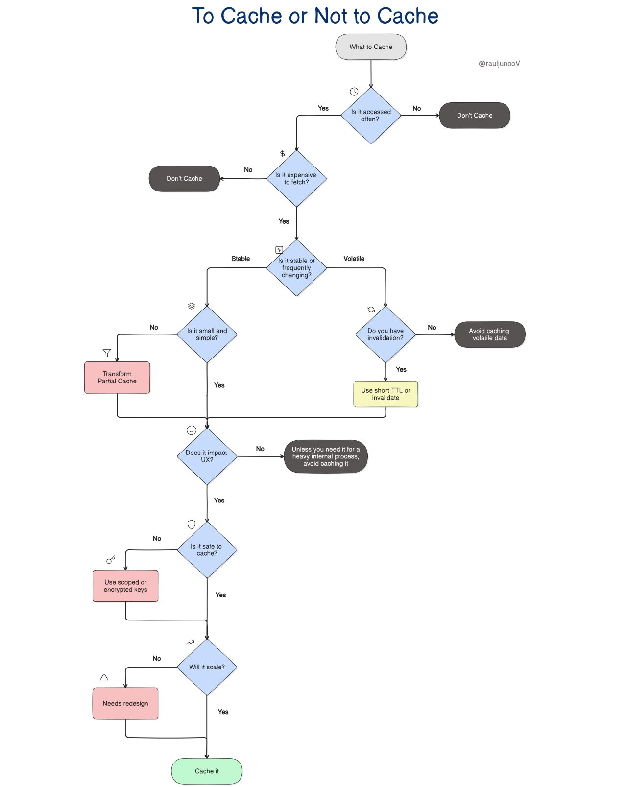

## 🧠 To Cache or Not to Cache — Markdown Summary

Caching should be a deliberate decision, not a reflex: most bugs come from caching the wrong thing, too soon, or without a clear reason, not from Redis or Memcached themselves.[^1]

```
📱 Client
   │  (fast path) ⚡
   ↓
┌───────────┐   miss ❌         hit ✅
│  🧠 Cache │─────────────┐  ┌────────────┐
└───────────┘             │  │  🚀 Serve  │
      │                   │  │  Response  │
      ↓                   │  └────────────┘
┌───────────┐             │
│  🗄️ DB    │◄────────────┘  fill 📦 + TTL ⏳
└───────────┘
```

Diagram above: High‑level cache fast path vs database fallback and fill with TTL.[^1]

### 🎯 The 7‑Question Caching Framework

- 🔁 Is the data accessed frequently? Cache high‑traffic keys to maximize return per byte; e.g., homepage product recommendations are requested thousands of times per hour, whereas a one‑off CSV export should hit the database.[^1]
- 🧮 Is it expensive to retrieve? Cache when reads require external services, multiple joins, or heavy aggregation; skip caching cheap primary‑key fetches from well‑indexed tables because they are already fast.[^1]
- 🧷 Is the data stable or volatile? Stable data is a great candidate for minutes or hours, while volatile data like stock levels during a flash sale needs either short TTLs or explicit invalidation hooks, or it should not be cached at all.[^1]
- 📦 Is the data small and simple? Favor small, flat payloads that serialize quickly and avoid large blobs that bloat memory and increase GC pressure; do not cache the entire product catalog—cache paginated views or summaries instead.[^1]
- ⚡ Does it directly impact user experience? Prioritize caching on the critical path where users feel latency, such as search results or product pages, and avoid caching background jobs that run at 2AM.[^1]
- 🔒 Is it safe to cache? Be careful with user‑specific or sensitive data by scoping keys per user or session, encrypting values, and using short TTLs; if it should not appear in logs, it does not belong in a shared cache.[^1]
- 📈 Will this scale? Control key cardinality, normalize inputs, set sensible TTLs, enforce size limits, and monitor hit/miss and eviction churn to prevent unbounded growth and eviction storms at higher user counts.[^1]

```
🤔 Start
  │
  ├─ Is access HOT? 🔥 (QPS high)
  │      │ yes
  │      ▼
  ├─ Is fetch COSTLY? 💸 (joins/IO/remote)
  │      │ yes
  │      ▼
  ├─ Is data STABLE? 🧊 (tolerates staleness)
  │      │ yes
  │      ▼
  ├─ SAFE to cache? 🔒 (no PII leakage)
  │      │ yes
  │      ▼
  └─▶ Cache ✅ with TTL ⏳ + size limits 📏
         │ no at any step
         ▼
       Don’t cache ❌ (or use tiny TTL 🕒 / per‑user scoped key 👤)
```

Diagram above: Seven‑question decision flow to determine whether to cache and how.[^1]



### ⏱️ Freshness Strategies: TTL vs Invalidation

- ⏳ TTL (Time‑to‑Live): “Set it and forget it” expiration that is simple and resilient, but risks brief staleness between updates and expiry.[^1]
- 🧹 Invalidation: Explicitly remove or update cache entries on data changes for higher freshness, at the cost of more complexity and tighter coupling.[^1]
- 🧭 Guidance: Use TTLs for mostly stable data, invalidation for volatile data that cannot tolerate staleness, and combine both when safety or UX demands it.[^1]

```
Path A: TTL ⏳
┌──────────┐   miss ❌    ┌──────────┐
│  🧠 Cache │───────────►│  🗄️ DB    │
└──────────┘            └──────────┘
     ▲   │  fill 📦 + TTL=300s
     │   └───────────────────────
     │
     └─ hit ✅ until TTL expires → auto‑refresh on next miss

Path B: Invalidation 🧹
Update 📝 → Event 📨 → ┌──────────┐
                       │  🧠 Cache │  DEL key 🔑
                       └──────────┘
Next read → miss ❌ → fetch → fill 📦 (fresh)
```

Diagram above: TTL passive freshness vs active invalidation flow on updates.[^1]

### 🧪 Examples and Anti‑Patterns

- ✅ Good: Cache a compact JSON with ~10 fields representing a precomputed analytics dashboard payload.[^1]
- ❌ Bad: Cache a massive blob with 1,000 nested items or create per‑search free‑form keys like search?q=… that explode key cardinality.[^1]
- 🧰 Better: Cache normalized, bounded keys for hot pages and recompute or sideload cold, one‑off exports.[^1]

```
Good ✅ (bounded key space)
key: dashboard:v2:org:123  →  {"kpis":[…], "ts":169…}

Bad ❌ (exploding cardinality)
key: search:q="red shoes size 9 sort=price desc user=…" → unbounded!

Better ✅
key: search:facet:shoes:red:size:9:page:1  (normalized & paginated)
```

Diagram above: Key design patterns to avoid cardinality explosions.[^1]

### 💓 Cache Where Users Feel It

- 🖼️ Critical Path Wins: Cache anything that improves perceived speed for page loads, renders, and submits, because users directly experience that latency.[^1]
- 🛠️ Background Work: Avoid spending memory on non‑interactive tasks where a few hundred milliseconds does not affect user experience.[^1]

```
User Click 🖱️
  │
  ├─ Critical Path ⚡
  │    └─ Page render → Cache first 🧠 → <100ms 😍
  │
  └─ Background 🛠️
       └─ Nightly ETL → No cache needed → Queue + batch ✅
```

Diagram above: Prioritizing cache on user‑visible paths over background jobs.[^1]

### 🛡️ Safety Checklist for Sensitive Data

- 👤 Scope keys by user, session, or tenant to prevent data leakage across contexts.[^1]
- 🧷 Encrypt sensitive values and prefer short TTLs for tokens and PII.[^1]
- 🚫 Rule of Thumb: If it cannot be safely logged, do not store it in a shared cache.[^1]

```
Per‑Tenant 🏢 / Per‑User 👤 Scoping
key: tenant:44:user:9:cart   ✅
key: user:9:session:abc123   ✅
key: global:cart             ❌ (leaks across users)

PII 🔒
value: ENC(aes256, payload) + TTL=300s + no logs 🛑
```

Diagram above: Safe scoping patterns and handling PII in cache.[^1]

### 📏 Scale Tactics to Avoid “Eviction Storms”

- 🧮 Bound cardinality by normalizing inputs and avoiding one‑time keys.[^1]
- 🗄️ Enforce size limits per key and per namespace to keep memory predictable.[^1]
- 🔁 Choose appropriate eviction policies (LRU, LFU) based on access patterns, and watch hit/miss and eviction churn.[^1]

```
Multi‑Tier Cache 🧱
┌───────────┐  hot 🔥  L1: in‑proc (ms)
│  L1 🧠     │  → 90% hits
└─────▲─────┘
      │ miss
┌─────┴─────┐  warm ♨️  L2: Redis/Memcached (sub‑ms)
│  L2 🧠     │  → 95% cumulative
└─────▲─────┘
      │ miss
┌─────┴─────┐  cold ❄️  Origin DB (ms‑s)
│  🗄️ DB     │  fill + TTL, backpressure 🧯
└───────────┘

Eviction Policy 🎛️
• LRU: recency‑based
• LFU: frequency‑based
• Size caps: per‑key/per‑namespace 📏
```

Diagram above: Multi‑tier caching and eviction strategies to tame storms.[^1]

### 🧭 Quick Gut‑Check Mental Model

- 📊 Three multipliers determine leverage: Access frequency × Retrieval cost × Staleness tolerance; if any term is near zero, caching yields little benefit, and if all are high, it is a prime caching opportunity.[^1]

```
Leverage ≈ 🔥 Frequency × 💸 Cost × 🧊 StalenessTolerance
If any ≈ 0 → Don’t cache ❌
If all high → Cache ✅ (with TTL ⏳ + limits 📏)
```

Diagram above: The mental multiplication model for caching ROI.[^1]

### ✅ Final Takeaways

- 🔁 Cache what is used frequently, expensive to fetch, and stable long enough to be worth it.[^1]
- ⚡ Focus caching where users feel the speedup, not just where metrics look nicer.[^1]
- 🔒 Never cache what is unsafe or cannot scale, and treat each key like a contract that must justify its existence.[^1]
- 🧠 Smart systems do not cache more, they cache better, with explicit trade‑offs, constraints, and clear reasons.[^1]