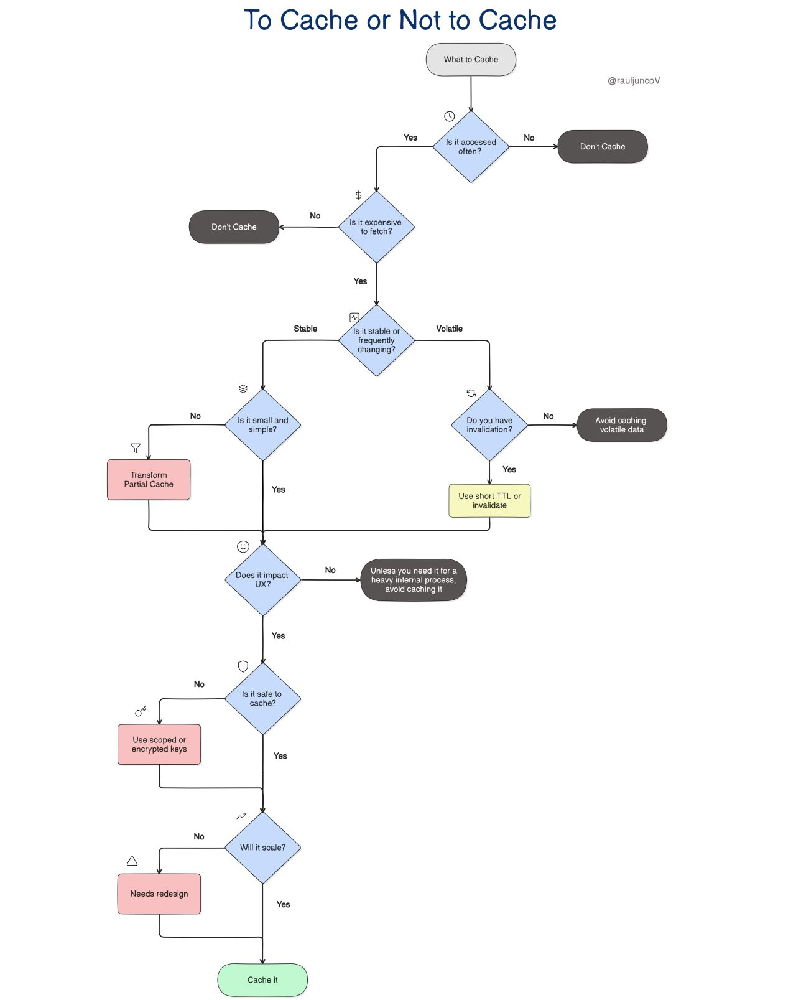

# System-Design
- # 🤖💭✨ [00-A. Generic LLM Prompts](./00-A.%20LLM%20Prompts/🎯%20LLM%20Prompt:%20Generic%20System%20Design.md)
- # 🧱🔗⚙️ [00-B. Building Blocks](./00-B.%20Building%20Blocks/)
- # 📹🎥🎬 [01. YouTube ☑️](./01.%20YouTube/)
- # 🎵🎭📱 [02. TikTok [Mock interview]]()
- # ❓🤔💡 [03. Quora]()
- # 🗺️📍🧭 [04. Google Maps]()
- # 📍🏪🔍 [05. Proximity Service / Yelp]()
- # 🚗🚖📱 [06. Uber]()
- # 🍔🚚📱 [07. Uber Eats]()
- # 🐦💬📱 [08. Twitter]()
- # 📰📱💬 [09. Newsfeed System]()
- # 📸🎨📱 [10. Instagram]()
- # 📰🔄📱 [11. NewsFeed [Mock interview]]()
- # 🔗✂️📏 [12. URL Shortening Service / TinyURL]()
- # 🕷️🌐🔍 [13. Web Crawler]()
- # 💬📱✅ [14. WhatsApp]()
- # 💬👥📱 [15. Facebook Messenger [Mock interview]]()
- # ⌨️💡🔍 [16. Typeahead Suggestion]()
- # 📝👥⚡ [17. Collaborative Document Editing Service / Google Docs]()
- # 💥🚨⚠️ [18. Spectacular Failures]()
- # 🤖💬🧠 [19. ChatGPT [Mock interview]]()
- # 🏁📋✨ [20. Concluding Remarks]()


# 🎯 Control Plane vs Data Plane Operations: The Ultimate Guide

## 🔍 Overview \& Key Concepts

Think of your distributed system as a bustling city 🏙️! The **control plane** is like the city's government and planning department - it makes all the high-level decisions, sets policies, creates infrastructure plans, and manages resources. The **data plane** is like the actual roads, traffic lights, and delivery trucks - it's where the real work happens, moving people and goods around based on the rules set by the government.[^1][^2][^3]

**🎭 The Theater Analogy**: If your system were a theater production:

- **Control Plane** 🎬: The director, producer, and stage manager who decide what play to perform, assign roles, set up the stage, and coordinate everything behind the scenes
- **Data Plane** 🎪: The actors, props, lighting, and sound equipment that actually deliver the performance to the audience

**Core Principles** ⚡:

- **Control Plane**: Policy, configuration, orchestration, and management
- **Data Plane**: Execution, processing, forwarding, and actual work
- **Independence**: Data plane can operate even when control plane is down[^4][^5]
- **Scalability**: Each plane scales differently based on their unique demands[^6][^7]


## 🏗️ Architecture Components

```
                    🎯 CONTROL PLANE (The Brain) 🧠
    ┌─────────────────────────────────────────────────────────────────┐
    │  🎛️ Management APIs    📋 Policies    🔧 Configuration           │
    │  ┌─────────────┐    ┌─────────────┐    ┌─────────────┐          │
    │  │ CREATE 📝   │    │ Routing 🗺️  │    │ Security 🔒 │          │
    │  │ UPDATE ✏️   │    │ Auth 🛡️     │    │ Scaling ⚖️  │          │
    │  │ DELETE 🗑️   │    │ Load Bal ⚖️ │    │ Monitoring📊│          │
    │  └─────────────┘    └─────────────┘    └─────────────┘          │
    └────────────────────┬────────────────────────────────────────────┘
                         │ 📡 Commands & Config
                         ↓
    ┌─────────────────────────────────────────────────────────────────┐
    │                  🚀 DATA PLANE (The Workers) 💪                  │
    │  ┌─────────────┐    ┌─────────────┐    ┌─────────────┐          │
    │  │ 🔄 Service A│    │ 🔄 Service B│    │ 🔄 Service C│          │
    │  │ Processing  │    │ Processing  │    │ Processing  │          │
    │  │ ┌─────────┐ │    │ ┌─────────┐ │    │ ┌─────────┐ │          │
    │  │ │ 📦 Data │ │    │ │ 📦 Data │ │    │ │ 📦 Data │ │          │
    │  │ │ 🔀 Route│ │    │ │ 🔀 Route│ │    │ │ 🔀 Route│ │          │
    │  │ │ ⚡ Cache│ │    │ │ ⚡ Cache│ │    │ │ ⚡ Cache│ │          │
    │  │ └─────────┘ │    │ └─────────┘ │    │ └─────────┘ │          │
    │  └─────────────┘    └─────────────┘    └─────────────┘          │
    └─────────────────────────────────────────────────────────────────┘
             ↑                    ↑                    ↑
             📱 User Requests     💻 Client Apps       🌐 External APIs
```

**Key Components Breakdown** 🔧:

**Control Plane Components** 🎛️:

- **Management APIs**: CRUD operations for resources
- **Policy Engine**: Security, routing, and business rules[^2][^8]
- **Configuration Store**: Settings, metadata, and state[^1][^6]
- **Orchestrator**: Service deployment and lifecycle management[^8][^9]

**Data Plane Components** 💪:

- **Request Processors**: Handle actual user requests[^2][^8]
- **Data Storage**: Databases, caches, and file systems[^10][^1]
- **Network Proxies**: Load balancers and service meshes[^8][^2]
- **Compute Engines**: Application logic and business processing[^9][^10]


## 🔄 Data Flow \& Interactions

```
    👤 Developer/Operator                   👥 End Users
         │                                     │
         │ 🎛️ Management                      │ 🎯 Business
         │    Operations                      │    Requests
         ↓                                     ↓
    ┌──────────────────┐                 ┌──────────────────┐
    │  🧠 CONTROL      │ 📡 Config      │  💪 DATA         │
    │     PLANE        │ ────────────→   │     PLANE        │
    │                  │                 │                  │
    │ 📋 Creates       │                 │ ⚡ Processes     │
    │ 🔧 Configures    │ ← ─ ─ ─ ─ ─ ─  │ 🔀 Routes       │
    │ 👀 Monitors      │   📊 Metrics    │ 💾 Stores       │
    │ 🛡️ Secures       │   & Telemetry   │ 🎯 Delivers     │
    └──────────────────┘                 └──────────────────┘
              ↕️                                    ↕️
    🗄️ Configuration Store              📊 Operational Data
```

**Interaction Flow Examples** 🎪:

**Netflix** 📺 **Scenario**:

1. **Control Plane**: Content manager uploads new movie → creates metadata, sets geo-restrictions, configures CDN rules[^11]
2. **Data Plane**: User clicks play → streams video data, applies geo-rules, serves from nearest CDN[^11]

**Uber** 🚗 **Scenario**:

1. **Control Plane**: New driver signs up → creates profile, sets pricing rules, configures service areas[^12]
2. **Data Plane**: User requests ride → matches with driver, calculates route, processes payment[^12]

## ⚖️ Trade-offs \& Design Decisions

**🎯 Availability vs Consistency Trade-offs**:


| Aspect | Control Plane 🧠 | Data Plane 💪 |
| :-- | :-- | :-- |
| **Availability SLA** | 99.9% (can tolerate brief outages)[^5][^7] | 99.99% (must stay up!)[^5][^7] |
| **Consistency** | Strong consistency required 🔒[^1][^3] | Eventually consistent OK ⏰[^1][^3] |
| **Complexity** | High - complex workflows \& logic 🤯[^3][^10] | Low - simple, fast operations ⚡[^3][^10] |
| **Latency** | Can be slower (100-500ms) 🐌[^5][^7] | Must be fast (<10ms) 🏃♂️[^5][^7] |

**🚨 Critical Design Decisions**:

**Static Stability** 🏗️: Your data plane should continue working even when the control plane fails! This is like having traffic lights with battery backup - even if the traffic control center goes down, the lights keep working with their last known schedule.[^4][^10]

**Blast Radius Limitation** 💥: Control plane changes should affect limited scope. If you're updating security policies, don't take down the entire data plane - roll out gradually![^7][^6]

**Resource Separation** 🏰: Keep control and data plane infrastructure separate. Use different:

- **CPU/Memory pools** 💻: Control plane gets compute for complex decisions, data plane gets optimized for throughput
- **Network segments** 🌐: Separate traffic to avoid interference
- **Storage systems** 💾: Different persistence needs and access patterns[^6][^10]


## 📊 Scalability Considerations

**🎢 Scaling Patterns**:

```
            📈 TRAFFIC GROWTH IMPACT
    
    Control Plane Scaling 🧠:
    ┌─────────────────────────────────┐
    │ Low traffic:    1 instance  📱  │
    │ Medium traffic: 2-3 instances💻 │  
    │ High traffic:   3-5 instances🖥️ │
    └─────────────────────────────────┘
         👆 Scales with CONFIG changes
    
    Data Plane Scaling 💪:
    ┌─────────────────────────────────┐
    │ Low traffic:    10 instances 📱 │
    │ Medium traffic: 100 instances💻 │
    │ High traffic:   1000+ instances🖥️│
    └─────────────────────────────────┘
         👆 Scales with USER LOAD
```

**Instagram** 📸 **Example**: When they hit 1 billion users:

- **Control Plane**: Maybe 10-20 instances handling account creation, photo upload policies, content moderation rules
- **Data Plane**: Thousands of instances serving photos, processing likes, handling comments[^1][^2]

**🎯 Scaling Strategies**:

**Control Plane Scaling** 🧠:

- **Horizontal**: Add more config management instances
- **Functional**: Split by domain (user management vs content management)
- **Regional**: Deploy control planes per geographic region[^9][^6]

**Data Plane Scaling** 💪:

- **Auto-scaling**: Based on CPU, memory, request rate
- **Geographic**: CDNs, edge computing, regional data centers
- **Sharding**: Partition data by user ID, content type, or geography[^7][^9]


## 🛠️ Implementation Details

**🎨 API Classification Framework**:

```python
# 🎯 Classification Decision Tree

def classify_api_operation(operation):
    
    # 🧠 CONTROL PLANE indicators
    if operation.involves_resource_lifecycle():  # CREATE, DELETE
        return "CONTROL_PLANE 🎛️"
    
    if operation.changes_configuration():       # Update settings
        return "CONTROL_PLANE 🔧"
    
    if operation.manages_policies():           # Security, routing rules
        return "CONTROL_PLANE 🛡️"
    
    # 💪 DATA PLANE indicators  
    if operation.processes_user_data():       # Read/Write business data
        return "DATA_PLANE ⚡"
    
    if operation.serves_content():            # Streaming, file download
        return "DATA_PLANE 🚀"
    
    if operation.handles_real_time():         # Chat, live updates
        return "DATA_PLANE 📡"
```

**📝 Real-World API Examples**:

**E-commerce Platform APIs** 🛒:


| API Endpoint | Classification | Reason |
| :-- | :-- | :-- |
| `POST /api/stores` | Control Plane 🧠 | Creates new store resource[^13][^9] |
| `PUT /api/stores/{id}/config` | Control Plane 🔧 | Updates store configuration[^13][^9] |
| `GET /api/products/{id}` | Data Plane ⚡ | Serves product data to users[^13][^9] |
| `POST /api/orders` | Data Plane 💪 | Processes customer transactions[^13][^9] |
| `PUT /api/cart/items` | Data Plane 🔄 | Updates user's shopping cart[^13][^9] |
| `POST /api/stores/{id}/analytics/reset` | Control Plane 📊 | Admin operation, not user data[^13][^9] |

**Video Streaming APIs** 📺:


| API Endpoint | Classification | Reason |
| :-- | :-- | :-- |
| `POST /api/content` | Control Plane 🎬 | Content management operation[^9][^11] |
| `PUT /api/content/{id}/geo-restrictions` | Control Plane 🌍 | Policy configuration[^9][^11] |
| `GET /api/stream/{id}` | Data Plane 🎥 | Actual video streaming[^9][^11] |
| `POST /api/views/{id}` | Data Plane 📈 | User interaction tracking[^9][^11] |
| `GET /api/recommendations/{userId}` | Data Plane 🎯 | Personalized content serving[^9][^11] |

## 🚨 Common Pitfalls \& Solutions

**🔥 Pitfall \#1: Control Plane on Critical Path**

```
❌ BAD: User request → Control Plane → Data Plane → Response
✅ GOOD: User request → Data Plane → Response (with cached config)
```

**Solution** 💡: Cache configuration in data plane, only consult control plane for updates![^10][^4]

**🔥 Pitfall \#2: Shared Failure Domains**

```
❌ BAD: Same database for user data and configuration
✅ GOOD: Separate databases, different infrastructure
```

**Solution** 💡: Use completely separate infrastructure stacks. Netflix does this religiously![^10][^11]

**🔥 Pitfall \#3: Overly Chatty Interface**

```
❌ BAD: Data plane calls control plane for every request
✅ GOOD: Batch configuration updates, use push notifications
```

**Solution** 💡: Implement event-driven configuration updates with tools like Kafka or Redis pub/sub![^6][^7]

**🔥 Pitfall \#4: Ignoring Static Stability**

- **Problem**: When control plane fails, data plane stops working
- **Solution**: Design data plane to function with "last known good" configuration
- **Example**: AWS Route 53 DNS keeps serving cached records even if control APIs are down[^4][^10]

**🔥 Pitfall \#5: Wrong API Classification**

```
❌ BAD: PUT /users/{id}/last-login-time → Control Plane
✅ GOOD: PUT /users/{id}/last-login-time → Data Plane
```

**Solution** 💡: Ask "Is this user-facing data or admin configuration?" User behavior data = Data Plane![^13][^5]

## 💡 Best Practices \& Tips

**🎯 Golden Rules for API Design**:

**Rule \#1: The Frequency Test** ⏱️

- **High frequency** (>100 requests/second) = Data Plane 💪
- **Low frequency** (<10 requests/minute) = Control Plane 🧠
- **Example**: User login (high) vs admin creating new service (low)[^5][^7]

**Rule \#2: The Impact Radius Test** 💥

- **Affects single user/session** = Data Plane ⚡
- **Affects multiple users/system** = Control Plane 🌍
- **Example**: User posting comment vs admin changing content policy[^13][^9]

**Rule \#3: The Downtime Tolerance Test** 🚨

- **Must be always available** = Data Plane 🚀
- **Can tolerate brief outages** = Control Plane 🛠️
- **Example**: Video streaming vs content upload workflows[^11][^10]

**🏆 Architecture Excellence Patterns**:

**Pattern \#1: Configuration Caching** ⚡

```
Data Plane Service:
├── 📋 Local Config Cache (Redis/In-memory)
├── 🔄 Background Config Sync Process  
└── ⚽ Circuit Breaker to Control Plane
```

**Pattern \#2: Graceful Degradation** 🛡️

```
When Control Plane is down:
├── ✅ Serve cached content
├── ✅ Use default configurations  
├── ✅ Log operations for later sync
└── ❌ Don't fail user requests!
```

**Pattern \#3: Progressive Rollouts** 📈

```
Control Plane Changes:
├── 🧪 Canary deployment (1% traffic)
├── 📊 Monitor data plane metrics
├── 🎯 Gradual rollout (10%, 50%, 100%)
└── 🔄 Quick rollback capability
```

**🎪 Pro Tips from the Trenches**:

**Tip \#1** 🎯: Use **feature flags** in your control plane to safely test changes without affecting data plane stability[^7][^6]

**Tip \#2** ⚡: Implement **health checks** that differentiate between control and data plane health - they can fail independently[^9][^10]

**Tip \#3** 📊: Set up **separate monitoring dashboards** - data plane metrics (latency, throughput) vs control plane metrics (configuration changes, policy updates)[^2][^8]

**Tip \#4** 🔐: Design **different security models** - control plane needs stronger authentication, data plane needs faster authorization[^1][^6]

**Tip \#5** 🌟: When in doubt, **bias toward data plane classification** - it's better to over-optimize for user-facing performance than admin convenience[^5][^9]

Remember: The goal is to build systems where your users can watch Netflix 📺, order Uber rides 🚗, and post on Instagram 📸 even when engineers are updating configurations behind the scenes! The magic happens when these two planes work in perfect harmony 🎭✨.

## 🧠 To Cache or Not to Cache — Markdown Summary

Caching should be a deliberate decision, not a reflex: most bugs come from caching the wrong thing, too soon, or without a clear reason, not from Redis or Memcached themselves.[^1]

```
📱 Client
   │  (fast path) ⚡
   ↓
┌───────────┐   miss ❌         hit ✅
│  🧠 Cache │─────────────┐  ┌────────────┐
└───────────┘             │  │  🚀 Serve  │
      │                   │  │  Response  │
      ↓                   │  └────────────┘
┌───────────┐             │
│  🗄️ DB    │◄────────────┘  fill 📦 + TTL ⏳
└───────────┘
```

Diagram above: High‑level cache fast path vs database fallback and fill with TTL.[^1]

### 🎯 The 7‑Question Caching Framework

- 🔁 Is the data accessed frequently? Cache high‑traffic keys to maximize return per byte; e.g., homepage product recommendations are requested thousands of times per hour, whereas a one‑off CSV export should hit the database.[^1]
- 🧮 Is it expensive to retrieve? Cache when reads require external services, multiple joins, or heavy aggregation; skip caching cheap primary‑key fetches from well‑indexed tables because they are already fast.[^1]
- 🧷 Is the data stable or volatile? Stable data is a great candidate for minutes or hours, while volatile data like stock levels during a flash sale needs either short TTLs or explicit invalidation hooks, or it should not be cached at all.[^1]
- 📦 Is the data small and simple? Favor small, flat payloads that serialize quickly and avoid large blobs that bloat memory and increase GC pressure; do not cache the entire product catalog—cache paginated views or summaries instead.[^1]
- ⚡ Does it directly impact user experience? Prioritize caching on the critical path where users feel latency, such as search results or product pages, and avoid caching background jobs that run at 2AM.[^1]
- 🔒 Is it safe to cache? Be careful with user‑specific or sensitive data by scoping keys per user or session, encrypting values, and using short TTLs; if it should not appear in logs, it does not belong in a shared cache.[^1]
- 📈 Will this scale? Control key cardinality, normalize inputs, set sensible TTLs, enforce size limits, and monitor hit/miss and eviction churn to prevent unbounded growth and eviction storms at higher user counts.[^1]

```
🤔 Start
  │
  ├─ Is access HOT? 🔥 (QPS high)
  │      │ yes
  │      ▼
  ├─ Is fetch COSTLY? 💸 (joins/IO/remote)
  │      │ yes
  │      ▼
  ├─ Is data STABLE? 🧊 (tolerates staleness)
  │      │ yes
  │      ▼
  ├─ SAFE to cache? 🔒 (no PII leakage)
  │      │ yes
  │      ▼
  └─▶ Cache ✅ with TTL ⏳ + size limits 📏
         │ no at any step
         ▼
       Don’t cache ❌ (or use tiny TTL 🕒 / per‑user scoped key 👤)
```

Diagram above: Seven‑question decision flow to determine whether to cache and how.[^1]



### ⏱️ Freshness Strategies: TTL vs Invalidation

- ⏳ TTL (Time‑to‑Live): “Set it and forget it” expiration that is simple and resilient, but risks brief staleness between updates and expiry.[^1]
- 🧹 Invalidation: Explicitly remove or update cache entries on data changes for higher freshness, at the cost of more complexity and tighter coupling.[^1]
- 🧭 Guidance: Use TTLs for mostly stable data, invalidation for volatile data that cannot tolerate staleness, and combine both when safety or UX demands it.[^1]

```
Path A: TTL ⏳
┌──────────┐   miss ❌    ┌──────────┐
│  🧠 Cache │───────────►│  🗄️ DB    │
└──────────┘            └──────────┘
     ▲   │  fill 📦 + TTL=300s
     │   └───────────────────────
     │
     └─ hit ✅ until TTL expires → auto‑refresh on next miss

Path B: Invalidation 🧹
Update 📝 → Event 📨 → ┌──────────┐
                       │  🧠 Cache │  DEL key 🔑
                       └──────────┘
Next read → miss ❌ → fetch → fill 📦 (fresh)
```

Diagram above: TTL passive freshness vs active invalidation flow on updates.[^1]

### 🧪 Examples and Anti‑Patterns

- ✅ Good: Cache a compact JSON with ~10 fields representing a precomputed analytics dashboard payload.[^1]
- ❌ Bad: Cache a massive blob with 1,000 nested items or create per‑search free‑form keys like search?q=… that explode key cardinality.[^1]
- 🧰 Better: Cache normalized, bounded keys for hot pages and recompute or sideload cold, one‑off exports.[^1]

```
Good ✅ (bounded key space)
key: dashboard:v2:org:123  →  {"kpis":[…], "ts":169…}

Bad ❌ (exploding cardinality)
key: search:q="red shoes size 9 sort=price desc user=…" → unbounded!

Better ✅
key: search:facet:shoes:red:size:9:page:1  (normalized & paginated)
```

Diagram above: Key design patterns to avoid cardinality explosions.[^1]

### 💓 Cache Where Users Feel It

- 🖼️ Critical Path Wins: Cache anything that improves perceived speed for page loads, renders, and submits, because users directly experience that latency.[^1]
- 🛠️ Background Work: Avoid spending memory on non‑interactive tasks where a few hundred milliseconds does not affect user experience.[^1]

```
User Click 🖱️
  │
  ├─ Critical Path ⚡
  │    └─ Page render → Cache first 🧠 → <100ms 😍
  │
  └─ Background 🛠️
       └─ Nightly ETL → No cache needed → Queue + batch ✅
```

Diagram above: Prioritizing cache on user‑visible paths over background jobs.[^1]

### 🛡️ Safety Checklist for Sensitive Data

- 👤 Scope keys by user, session, or tenant to prevent data leakage across contexts.[^1]
- 🧷 Encrypt sensitive values and prefer short TTLs for tokens and PII.[^1]
- 🚫 Rule of Thumb: If it cannot be safely logged, do not store it in a shared cache.[^1]

```
Per‑Tenant 🏢 / Per‑User 👤 Scoping
key: tenant:44:user:9:cart   ✅
key: user:9:session:abc123   ✅
key: global:cart             ❌ (leaks across users)

PII 🔒
value: ENC(aes256, payload) + TTL=300s + no logs 🛑
```

Diagram above: Safe scoping patterns and handling PII in cache.[^1]

### 📏 Scale Tactics to Avoid “Eviction Storms”

- 🧮 Bound cardinality by normalizing inputs and avoiding one‑time keys.[^1]
- 🗄️ Enforce size limits per key and per namespace to keep memory predictable.[^1]
- 🔁 Choose appropriate eviction policies (LRU, LFU) based on access patterns, and watch hit/miss and eviction churn.[^1]

```
Multi‑Tier Cache 🧱
┌───────────┐  hot 🔥  L1: in‑proc (ms)
│  L1 🧠     │  → 90% hits
└─────▲─────┘
      │ miss
┌─────┴─────┐  warm ♨️  L2: Redis/Memcached (sub‑ms)
│  L2 🧠     │  → 95% cumulative
└─────▲─────┘
      │ miss
┌─────┴─────┐  cold ❄️  Origin DB (ms‑s)
│  🗄️ DB     │  fill + TTL, backpressure 🧯
└───────────┘

Eviction Policy 🎛️
• LRU: recency‑based
• LFU: frequency‑based
• Size caps: per‑key/per‑namespace 📏
```

Diagram above: Multi‑tier caching and eviction strategies to tame storms.[^1]

### 🧭 Quick Gut‑Check Mental Model

- 📊 Three multipliers determine leverage: Access frequency × Retrieval cost × Staleness tolerance; if any term is near zero, caching yields little benefit, and if all are high, it is a prime caching opportunity.[^1]

```
Leverage ≈ 🔥 Frequency × 💸 Cost × 🧊 StalenessTolerance
If any ≈ 0 → Don’t cache ❌
If all high → Cache ✅ (with TTL ⏳ + limits 📏)
```

Diagram above: The mental multiplication model for caching ROI.[^1]

### ✅ Final Takeaways

- 🔁 Cache what is used frequently, expensive to fetch, and stable long enough to be worth it.[^1]
- ⚡ Focus caching where users feel the speedup, not just where metrics look nicer.[^1]
- 🔒 Never cache what is unsafe or cannot scale, and treat each key like a contract that must justify its existence.[^1]
- 🧠 Smart systems do not cache more, they cache better, with explicit trade‑offs, constraints, and clear reasons.[^1]


<span style="display:none">[^14][^15][^16][^17][^18][^19]</span>

<div style="text-align: center">⁂</div>


[^1]: https://www.snaplogic.com/blog/data-plane-vs-control-plane-whats-the-difference

[^2]: https://blog.envoyproxy.io/service-mesh-data-plane-vs-control-plane-2774e720f7fc

[^3]: https://www.ibm.com/think/topics/control-plane-vs-data-plane

[^4]: https://docs.aws.amazon.com/wellarchitected/latest/reducing-scope-of-impact-with-cell-based-architecture/control-plane-and-data-plane.html

[^5]: https://stackoverflow.com/questions/77159234/mental-model-for-control-plane-and-data-plane

[^6]: https://pinggy.io/blog/control_plane_vs_data_plane/

[^7]: https://www.splunk.com/en_us/blog/learn/control-plane-vs-data-plane.html

[^8]: https://www.linkedin.com/pulse/managing-microservices-service-mesh-data-vs-control-plane-goyal

[^9]: https://developers.cloudflare.com/reference-architecture/diagrams/storage/durable-object-control-data-plane-pattern/

[^10]: https://docs.aws.amazon.com/whitepapers/latest/aws-fault-isolation-boundaries/control-planes-and-data-planes.html

[^11]: https://www.geeksforgeeks.org/system-design/system-design-netflix-a-complete-architecture/

[^12]: https://www.geeksforgeeks.org/system-design/system-design-of-uber-app-uber-system-architecture/

[^13]: https://google.aip.dev/111

[^14]: https://learn.microsoft.com/en-us/azure/azure-resource-manager/management/control-plane-and-data-plane

[^15]: https://www.geeksforgeeks.org/difference-between-control-plane-and-data-plane/

[^16]: https://konghq.com/blog/learning-center/control-plane-vs-data-plane

[^17]: https://www.netguru.com/blog/api-design-patterns

[^18]: https://learn.microsoft.com/en-us/azure/architecture/best-practices/api-design

[^19]: https://blog.dreamfactory.com/microservices-examples